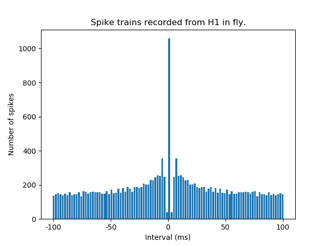
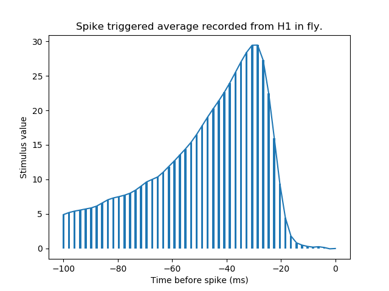

# Coursework 2. Nikolay Alexandrov

## Question 1

### Poisson train with zero refractory period

The **Fano factor** is F = _0.7009_

The **Coefficient of Variation** is CV = _0.8221_

### Poisson train with 5ms refractory period

The **Fano factor** is F = _0.9924_

The **Coefficient of Variation** is CV = _0.9915_

## Question 2

### Fly H1 neuron spike train with 2ms refactory period

The **Fano factor** is F = _2.7184_

The **Coefficient of Variation** is CV = _2.0085_

## Question 3

## Question 4

